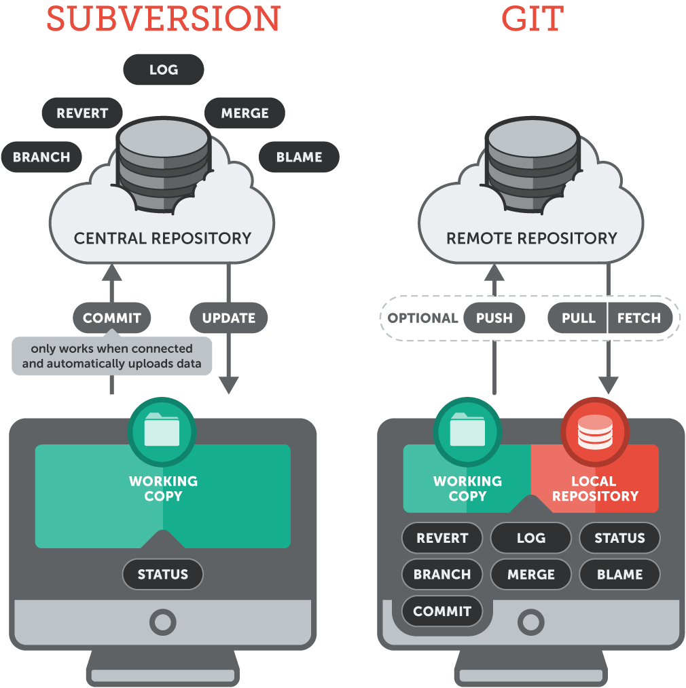
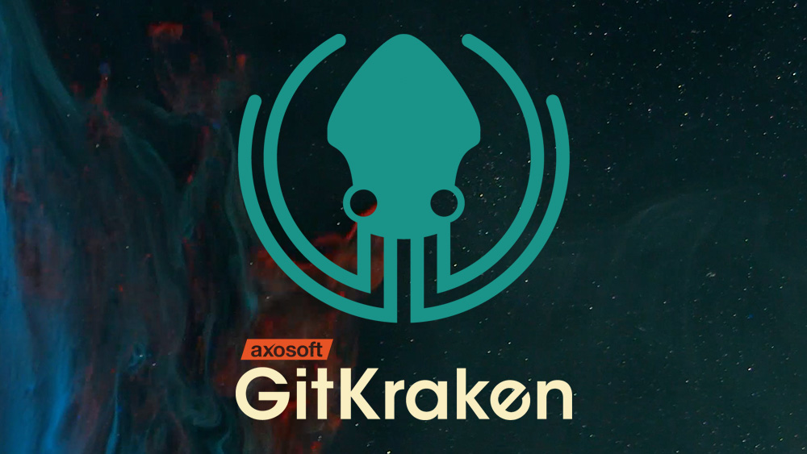

# Version Control 

<medium>
Good practices in bioinformatics 
May 7th, 2018 - CRG
</medium>

<small style="width: 50%; margin-top: 0.5em; color: grey;">
Emilio Palumbo
Toni Hermoso
</small>

## What is version control?

a method to record changes to a file or set of files over time

<i style="color: #189acb;" class="fas fa-caret-right"></i> **when**, **who**, **what**

## Why you should you use it

<!-- .slide: data-background-image="images/phd101212s.gif" data-background-size="contain" -->

<!-- .slide: data-background-image="images/phd052810s.gif" data-background-size="contain" -->

## Basic concept

Save files as logical sets of changes and write a good description of why you changed them 

<i style="color: #189acb;" class="fas fa-caret-right"></i> `commit`

## Benefits

- transparency
- change history
- recovery from errors/deletions
- automatic backup
- easier collaborative work
- reproducibility

## Uses
(either alone or collaboratively)

- papers
- lectures
- documentation
- scripts (R, Python, whatever else)
- text/tabular files

## Version Control Systems

stand-alone tools that record changes to a file or set of files over time

<i style="color: #189acb;" class="fas fa-caret-right"></i> often referred to as **VCSs**

## What you can do

- review changes made over time
- revert files/the entire project back to a previous state
- see who last modified something that might be a problem
- find out where and how things went wrong
- remove content knowing that you can easily go back

## Quick history

~ 40 years since first use

<i style="color: #189acb;" class="fas fa-caret-right"></i> three main generations

## local

a simple local database keeps all the changes to files under version control (e.g. `RCS`)

<!-- .element: width="50%" -->

## centralized

a single server contains all the versioned files, and a number of clients check out files from that central place (e.g. `SVN`)

<!-- .element: width="60%" -->

## distributed

clients fully mirror the repository, including its full history (e.g. `GIT`)

<!-- .element: width="40%" -->

## What is Git?

an **open source**, **distributed**, version control system

<i style="color: #189acb;" class="fas fa-caret-right"></i> most used thanks to its simplicity and GitHub 

<i style="color: #189acb;" class="fas fa-caret-right"></i> GitHub is a web-based Git repository hosting service, which offers all the functionalities of Git as well as adding its own features

## Features

- snapshot based
- nearly every operation is local
- integrity, everything is checksummed
- generally only adds data
- every local repository is a backup

## Distributed

<!-- .element: width="50%" -->

## Traditional model

Delta based

## Git model

Stream of snapshots

## Git hosting services

- social coding
- version control as a service
- in-browser editing
- additional collaborative features

[<!-- .element width="40%" -->](https://github.com)
[<!-- .element width="40%" -->](https://bitbucket.org)
[<!-- .element width="40%" -->](https://gitlab.com/)

## Git Clients

[<!-- .element width="35%" -->](https://git-scm.com/downloads)

<i style="color: #189acb;" class="fas fa-caret-right"></i> command line tool

[<!-- .element width="30%" -->](https://www.gitkraken.com/)
[<!-- .element width="35%" -->](https://www.sourcetreeapp.com/)
[<!-- .element width="20%" -->](https://desktop.github.com/)

<i style="color: #189acb;" class="fas fa-caret-right"></i> third party graphical user interface (GUI) tools

## References
- https://git-scm.com/docs
- https://git-scm.com/book/en/v2/Getting-Started-Git-Basics
- https://git-scm.com/downloads/guis/
- http://karthik.github.io/git_intro/
- http://rogerdudler.github.io/git-guide/

<!-- .slide: data-background-color="#000" -->
## Demo 